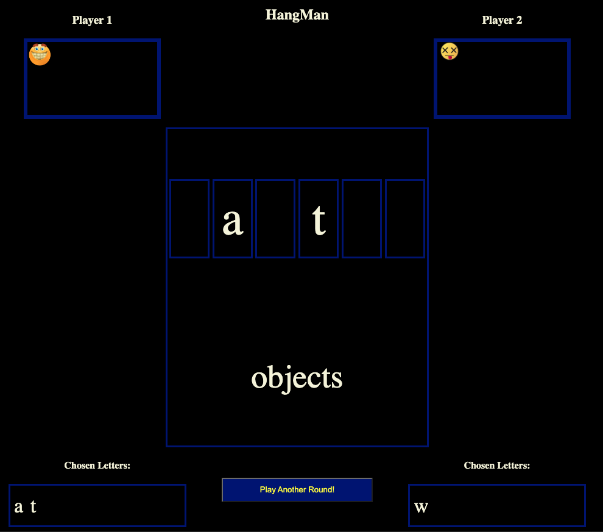

# 2-Player Hangman Game

## Game's Name: 2-Player Hangman

### Description

2-Player Hangman is a classic word-guessing game in this version is the software whom selects a word, and two players compete to guess it. Players take turns guessing letters, and if a player misses more than 7 times, he lose the game, if the word is guessed the player with more guessed letters wins. This game provides an engaging way for two players to interact and challenge each other’s vocabulary skills.

I chose this game because of its simple yet entertaining nature, and it provides a great way to practice JavaScript, HTML, and CSS skills.

## Getting Started

### Deployed Game

You can play the game [here](https://babujal.github.io/HangMan/).

### Instructions

1. The computer selects a word for the players to guess.
2. Players take turns guessing letters one at a time.
3. The game displays the current state of the word and the number of remaining guesses.
4. The game ends when either player guesses the word correctly or misses more than 7 times.

## Technologies Used

- JavaScript
- HTML
- CSS

## Next Steps

Planned future enhancements include:

- Adding the actual hangman drawing.
- DRY up more my code.
- Put more time on the style by making it more responsive.
- Enhancing the user interface with animations and sound effects.

---

Enjoy playing the 2-player Hangman game!

